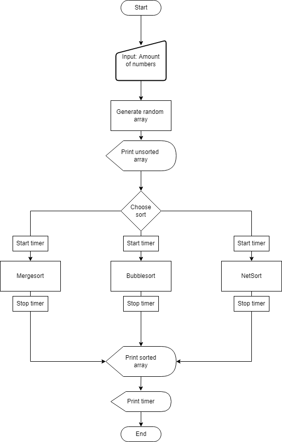
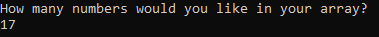
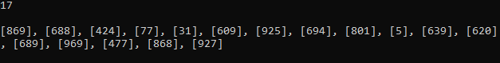
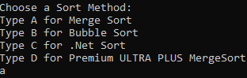
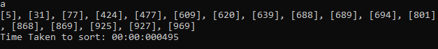
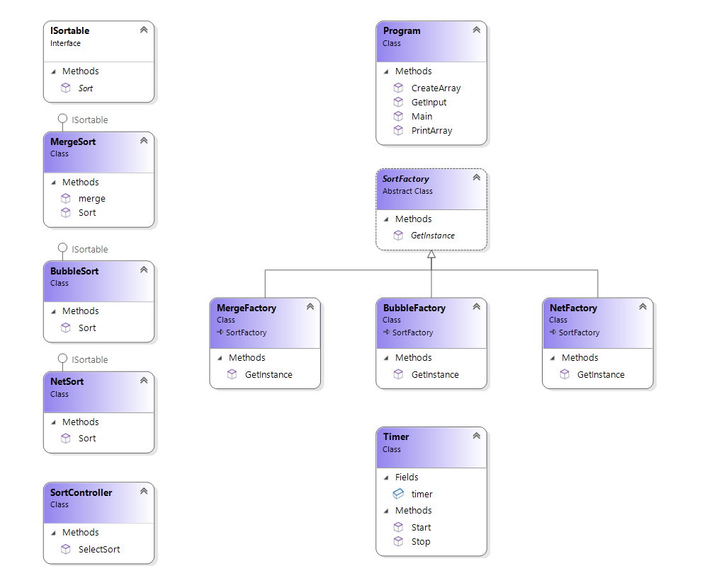

# Eng104 | Console Sort Manager Project

This program sorts a list of numbers using any selected algorithm.

The user is prompted to input the size of an array, which gets created and filled with random integers by using the Random class in C#.  The user is then able to choose the following sorting algorithms to sort the array from smallest to largest:

- [Merge sort](https://en.wikipedia.org/wiki/Merge_sort)
- [Bubble sort](https://en.wikipedia.org/wiki/Bubble_sort)
- [Visual Studio's own Sort implementation](https://docs.microsoft.com/en-us/dotnet/api/system.collections.generic.list-1.sort?view=net-6.0)
- Proprietary James' MergeSort™

The sorted array is then printed back to the user along with the time taken to complete the sort.

## Flow Diagram

This flow chart shows the user's journey whilst using the application.

## User Journey

A step-by-step analysis of the user journey

1. The user is prompted to enter a number for the size of the array.

2. The array is then shown to the user
   

3. The user is given another prompt which allows them to select which sorting algorithm they wish to use to sort the array.
   

4. After the sorting algorithm has completed sorting the array, it would print back the sorted array along with the time elapsed from the beginning of the sort to the end.
   

   

## Detailed explanation

We used Model-View-Controller design pattern to develop Sort Manager. The model is our data, the view is our interface and the controller handles the operations. 

The sorting methods along with the timer exist in separate classes, to adhere to the SOLID principles of object oriented programming.  They all implement the interface ISortable, in order to use the factory design pattern and to ensure our logic in the controller is kept to a minimum.

#### Merge sort

Merge sort sorts an array using divide and conquer. A list is divided repeatedly into two until every element is separated. Different elements are then compared with one another and then placed ahead or before depending if the element is smaller or larger until ultimately it resorts to a sorted array.

#### Bubble sort

Bubble sort works by using a nested loop and reiterating through the array whilst comparing each element with the one beside it. The element will rearrange it's position depending on whether it is smaller or larger than the next element in the array.

#### Net sort

The built-in sorting method Array.Sort() uses the Quicksort algorithm.  Quicksort, much like Merge sort, is a divide and conquer algorithm. It works by choosing an element within the array and 'pivots' it and partitions the other elements into two different sub-arrays, depending if they are larger or smaller. 

## UML diagram

## Our Initial Design Requirements

The flow of using this system should be as follows:

* The user is presented with a number of sort algorithms to choose from `Console`
* Decision is given via the command line (using `Console.ReadLine()`)
* The program will then ask for the length of an array via the command line

> **The program should then output:**
>
> * The unsorted randomly generated array
> * The algorithm to be used
> * The sorted array after the algorithm has been executed
> * Time taken

The sorting algorithms uses should include:

* BubbleSort
* MergeSort
* .NET Library Sort Methods

The system should make use of the MVC (Model View Controller) pattern to seperate the IO (View) from the controller and model with the Factory Method pattern used to generate the requested model classes.

